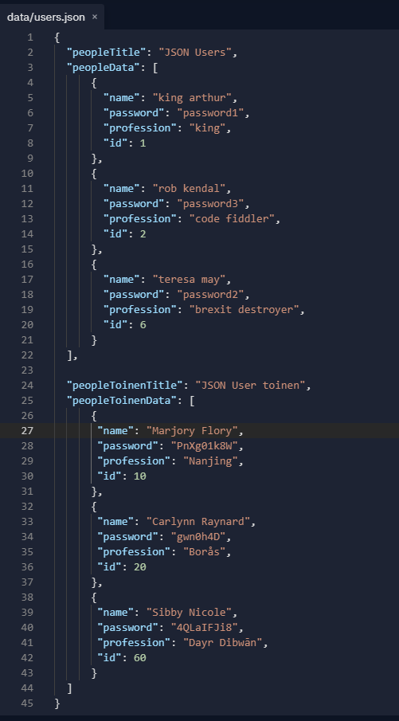
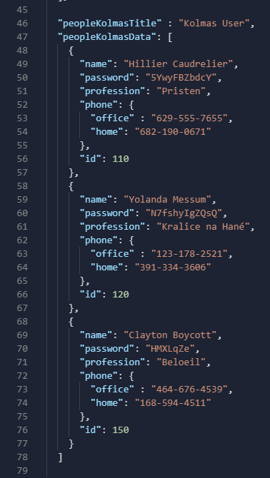

<h1>Routes polku, JSON tiedoston käsittely EJS pohjaan 2.8.2021 </h1>

Osa tämän toiminta methodi pohjautuvat <b> "RoutesPath_readJsonFile" </b> ja  <b> "ExpressWithCookieParser-ReadJson" </b> - harjoitukseen, 
ja tässä käytettään yhä routes polkua, ja json tiedoston lukemista. 

JSON tiedoston lukemisessa, että yritettään lukaista sisäisen objektin tekijänssä. Mitä tässä harjoituksessa kuin yhdistettäisi molempia, ja pien haaste voi olla...

Express eli verkkosivustossa hyödynnettään ejs, mikä pohjautuu html toiminta ja sisäisen funktiossa yritettään tulostaa JSOn tiedoston tekijänssä dataa.
Esim. tällainen JSON tiedostoa::
 

Syntaksissa tapahtuu toimintoja eli nämä: <%%>
<%%> - scripti tag, kontrolli, ohjausvirta, ja ei tulosta
<%= %> - tulostaa arvon mallin (HTML - koodattu)
<%- %> - tulostaa arvon, jossa ei ole koodimerkkiiä, malliin

<b>Että esim yritettäisi tulostaa verkkosivustossa mm. otsikko ja nimet listattuna</b>

<b>Default ejs home page with json data object </b>

 

